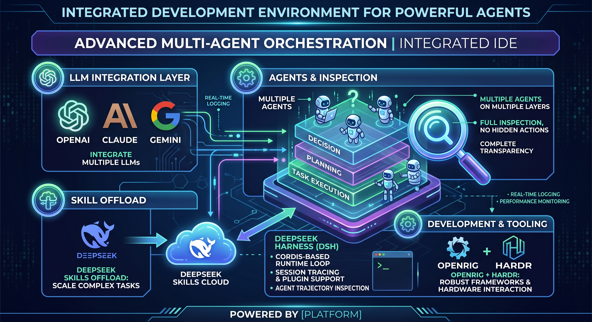

# Multiple-Agent Orchestration

A practical, step-by-step guide to running a **team of AI coding agents** on your own machine:
several Claude Code (and Antigravity `agy`) sessions that work in parallel, hand work to each other
through a durable queue, and push the bulk of the typing to cheap **DeepSeek workers**.

This guide was written from a real run: a team of agents migrated a production Python server
(`4genthub`) to Go, file by file, while the human watched and steered. Everything here was
done on one WSL2 machine on 2026-10-01 and the commands were checked there. A second session on
2026-10-02 added a second team (two pods in one rig), the owner-leads-workers rule and the fixes in
chapter 12. A third session on 2026-10-05 added **chapter 14** and rewrote the fleet-loss entry in
chapter 12, after a whole-fleet tmux crash was diagnosed on the same machine, and **chapter 15**,
which records the architecture the project converged into — the seat model (position vs occupant,
seat types you own) and the cloud/client split.



## What you will build

```
            you (human)
                │  rig send / rig queue / rig tui
                ▼
        ┌──────────────── OpenRig daemon (rig) ────────────────┐
        │  rigs = teams · seats = agent sessions · queue = work │
        └───────┬───────────────────────────────┬──────────────┘
                │ tmux or herdr panes            │ watchdogs (wake-ups)
        ┌───────▼────────┐              ┌────────▼────────┐
        │ dev-owner      │  handoff     │ dev-check       │
        │ (Claude Code)  │─────────────▶│ (Claude Code)   │
        └───────┬────────┘   review     └─────────────────┘
                │ dsh-offload start (background jobs)
        ┌───────▼───────────────────────────┐
        │ DeepSeek Harness (dsh) workers    │  cheap, parallel drafting
        └───────────────────────────────────┘
```

## How to read this guide

Follow the chapters in order the first time. Each one ends with a **Check** you can run.

| # | File | You will learn |
|---|------|----------------|
| 1 | [docs/01-introduction.md](docs/01-introduction.md) | The ideas and vocabulary: rig, seat, pod, queue, culture, offload |
| 2 | [docs/02-prerequisites.md](docs/02-prerequisites.md) | Machine, accounts and versions you need first |
| 3 | [docs/03-install-openrig.md](docs/03-install-openrig.md) | Install OpenRig (`rig`) and start the daemon |
| 4 | [docs/04-install-deepseek.md](docs/04-install-deepseek.md) | Install the DeepSeek Harness and `deepseek-offload` |
| 5 | [docs/05-terminals-and-runtimes.md](docs/05-terminals-and-runtimes.md) | tmux, herdr, Claude Code and `agy` runtimes |
| 6 | [docs/06-first-team.md](docs/06-first-team.md) | Write a `rig.yaml`, launch your first team |
| 7 | [docs/07-daily-use-cheatsheet.md](docs/07-daily-use-cheatsheet.md) | Every command you use day to day |
| 8 | [docs/08-culture-and-standing-mission.md](docs/08-culture-and-standing-mission.md) | Give the team a mission that survives restarts |
| 9 | [docs/09-deepseek-offload-workflow.md](docs/09-deepseek-offload-workflow.md) | Run waves of DeepSeek workers and review them |
| 10 | [docs/10-token-economy-and-compaction.md](docs/10-token-economy-and-compaction.md) | Spend fewer tokens: compaction, watchdogs, offload |
| 11 | [docs/11-case-study-python-to-go.md](docs/11-case-study-python-to-go.md) | The real migration, step by step |
| 12 | [docs/12-troubleshooting.md](docs/12-troubleshooting.md) | Every problem we actually hit, with the fix |
| 13 | [docs/13-safety-and-security.md](docs/13-safety-and-security.md) | Permissions, secrets, blast radius |
| 14 | [docs/14-keeping-the-fleet-alive.md](docs/14-keeping-the-fleet-alive.md) | Liveness vs activity: notice a dead fleet, heartbeat the watchdog, recover in a minute |
| 15 | [docs/15-architecture-seat-model-and-cloud.md](docs/15-architecture-seat-model-and-cloud.md) | Where this converges: position vs occupant, seat types you own, and the cloud/client split |
| – | [SOURCES.md](SOURCES.md) | Every source, repo, package and path this guide relies on |

Ready-to-copy files:

- [templates/](templates/) — `rig.yaml` (two seats), `rig-omp-10-seats.yaml` (a real ten-seat pod),
  `CULTURE.md`, `TEAM_SPLIT.md`, watchdog reminder, DeepSeek prompt, e2e account example, migration ledger
- [scripts/](scripts/) — `doctor.sh` (check the machine), `status.sh` (one-screen status of teams and
  migration) and `rig-watchdog.sh` (catch and restore a rig whose seats have vanished)

## The five-minute version

```bash
npm install -g @openrig/cli          # 1. the orchestrator
rig setup --dry-run && rig setup     # 2. prepare the machine
claude auth login                    # 3. log in to the runtime you use
cd ~/my-repo
rig up ./rig.yaml                    # 4. start a team (see templates/rig.yaml)
rig send dev-owner@my-team "Do <one bounded task>. Track it on the queue."
rig ps --nodes --rig my-team         # 5. watch it work
```

Then read chapters 8–10 to make the team run for hours without you.

## Honesty notes

- Commands marked **(verified)** were run on the author's machine. Anything marked **(not verified)**
  comes from upstream docs only. When a tool changes, trust `rig --help` over this text.
- OpenRig 0.6.3 and the DeepSeek Harness (`0.1.7-rc.2`, developer preview) change quickly.
- No credentials are stored in this guide. [templates/e2e-account.env.example](templates/e2e-account.env.example)
  shows the shape only.
